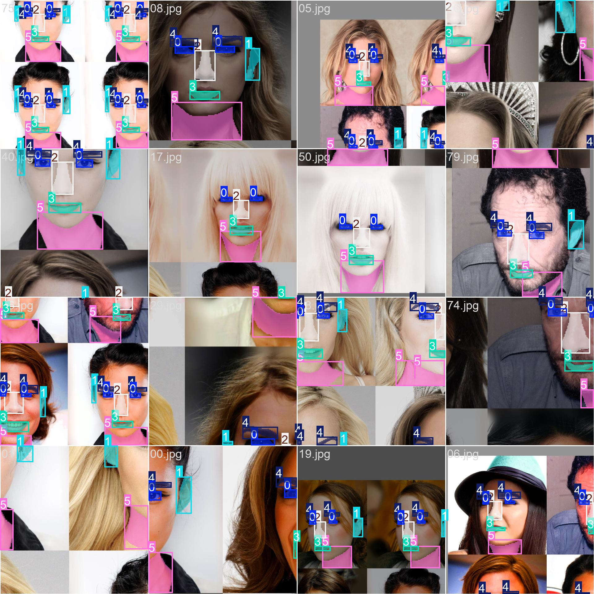

# Face Similarity

## Dataset

- CelebAMask-HQ dataset is used for training.
- Only 100 datasets are used with 80% for training and 20% for validation.
- Used only a few classes of CelebAMask-HQ which include:
  'eyes': 0,
  'ear': 1,
  'nose': 2,
  'mouth': 3,
  'brow': 4,
  'neck':5

## Results

- All obtained results can be viewed in the result folder.

### Training Data example:

### Validation Data example:

